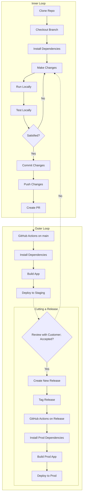

# Multi-Stage Deployment Example with Next.JS and Github Pages

This repository contains an example of deploying a Next.JS application to multiple stages or environments using GitHub Pages and GitHub Actions. It consists of two repositories:

## multi-stage-deployment-example-nextjs-github-pages-staging

This repository contains the code for the Next.JS application that is deployed to the staging environment via GitHub Pages. It includes a configuration file that specifies the URL of the staging environment and any other necessary details.

To deploy the application to the staging environment, you can push your code changes to the `main` branch of this repository. The application will be automatically deployed to the staging environment by GitHub Pages.

## multi-stage-deployment-example-nextjs-github-pages-production

This repository contains the code and configuration for the GitHub Actions workflow that deploys the Next.JS application to the production environment. It includes a configuration file that specifies the URL of the production environment and any other necessary details.

To deploy the application to the production environment, you can create a new release of the application in the staging repo and tag it with the desired version number. The GitHub Actions workflow will automatically deploy the application to the production environment.

To use this example in your own project, you can fork these repositories and customize them to fit your specific needs.

---

This is a [Next.js](https://nextjs.org/) project bootstrapped with [`create-next-app`](https://github.com/vercel/next.js/tree/canary/packages/create-next-app).

## Getting Started

First, run the development server:

```bash
npm run dev
# or
yarn dev
```

Open [http://localhost:3000](http://localhost:3000) with your browser to see the result.

You can start editing the page by modifying `pages/index.tsx`. The page auto-updates as you edit the file.

[API routes](https://nextjs.org/docs/api-routes/introduction) can be accessed on [http://localhost:3000/api/hello](http://localhost:3000/api/hello). This endpoint can be edited in `pages/api/hello.ts`.

The `pages/api` directory is mapped to `/api/*`. Files in this directory are treated as [API routes](https://nextjs.org/docs/api-routes/introduction) instead of React pages.

This project uses [`next/font`](https://nextjs.org/docs/basic-features/font-optimization) to automatically optimize and load Inter, a custom Google Font.

## Dev Loops

### Inner Loop

The inner loop is the development loop that you run on your local machine. It consists of the following steps:

1. Clone the repository
2. Checkout a new branch for your changes
3. Install dependencies
4. Make changes to the code
5. Run the application locally
6. Test/Review the application locally
7. Iterate on steps 4-6 until you are satisfied with the changes
8. Commit your changes
9. Push your changes to the remote repository
10. Create a pull request to merge your changes into the `main` branch

### Outer Loop

The outer loop is the deployment loop that runs automatically when you push your changes to the remote repository. It consists of the following steps:

1. GitHub Actions workflow is triggered by a push to the `main` branch
2. The workflow installs dependencies
3. The workflow builds the application
4. The workflow deploys the application to the staging environment

### Cutting a Release

The release loop is the deployment loop that runs when you create a new release of the application. This is usually done after reviewing the application in the staging environment with the customer. It consists of the following steps:

1. Create a new release of the application in the staging repository
2. Tag the release with the desired version number
3. GitHub Actions workflow is triggered by the creation of the release
4. The workflow installs dependencies in the production repository
5. The workflow builds the application in the production repository
6. The workflow deploys the application to the production environment

### Rollback Loop

The rollback loop is the deployment loop that runs when you need to rollback a release of the application. It consists of the following steps:

1. Create a new release of the application in the staging repository referencing the previous version
2. Tag the release with the desired version number
3. GitHub Actions workflow is triggered by the creation of the release
4. The workflow installs dependencies in the production repository
5. The workflow builds the application in the production repository
6. The workflow deploys the application to the production environment

### Hotfix Loop

The hotfix loop is the deployment loop that runs when you need to deploy a hotfix to the production environment. It consists of the following steps:

1. Create a new hotfix branch from the `main` branch in the staging repository
2. Checkout the hotfix branch
3. Make the necessary changes to the code
4. Commit the changes
5. Push the changes to the remote repository
6. Create a pull request to merge the changes into the `main` branch
7. Merge the pull request into the `main` branch
8. Create a new release of the application in the staging repository referencing the previous version
9. Tag the release with the desired version number
10. GitHub Actions workflow is triggered by the creation of the release
11. The workflow installs dependencies in the production repository
12. The workflow builds the application in the production repository
13. The workflow deploys the application to the production environment
14. Merge the hotfix branch into existing feature branches as necessary

### Mermaid Diagram Describing Dev Loops



## Learn More

To learn more about Next.js, take a look at the following resources:

- [Next.js Documentation](https://nextjs.org/docs) - learn about Next.js features and API.
- [Learn Next.js](https://nextjs.org/learn) - an interactive Next.js tutorial.

You can check out [the Next.js GitHub repository](https://github.com/vercel/next.js/) - your feedback and contributions are welcome!

## Deploy on Vercel

The easiest way to deploy your Next.js app is to use the [Vercel Platform](https://vercel.com/new?utm_medium=default-template&filter=next.js&utm_source=create-next-app&utm_campaign=create-next-app-readme) from the creators of Next.js.

Check out our [Next.js deployment documentation](https://nextjs.org/docs/deployment) for more details.

Hello world
